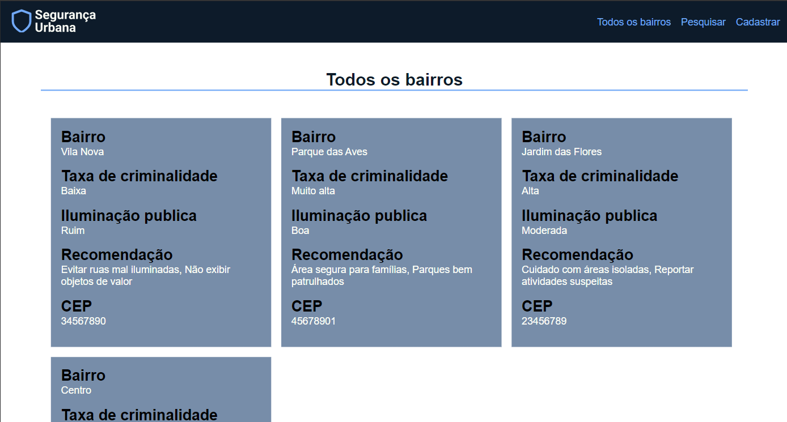

# Segurança Urbana
Esse projeto foi desenvolvido com o objetivo de alertar as pessoas sobre a segurança urbana de determinados bairros, onde as pessoas podem cadastrar ou buscar bairros , com o intuito de promover a segurança.

Para executar o projeto, vá para o último tópico: <a href="##getting-started">🚀 Getting started</a>.

## 🎨 Layout


## ⚙️ Sobre o projeto

O projeto está completamente funcional, integrando um FrontEnd dinâmico e o React estilizando com o css. O BackEnd utiliza o Express, junto ao Sequelize (MySQL) como banco de dados para uma eficiente manipulação de dados. A segurança é assegurada com a utilização do bcrypt para autenticação de usuários, garantindo o armazenamento seguro e a proteção das credenciais no sistema.

Link da publicação no linkedin: https://www.linkedin.com/feed/update/urn:li:activity:7181437395739828225/

## 💻 Tecnologias

- React
- Axios
- React-router-dom
- React-input-mask


<h2 id="#getting-started">🚀 Getting started (Uso local)</h2>

 Para funcionar tudo corretamente, antes de iniciar o projeto, é necessário iniciar api do projeto. Você pode baixar a api nesse link: https://github.com/gabriel-augg/seguranca-urbana-api .

<h4>1 - Baixando o projeto</h4>

Selecione um local de preferência, abra o terminal neste local e execute o seguinte comando:

```bash
git clone https://github.com/gabriel-augg/seguranca-urbana
```

<h4>2 - Baixando as dependências</h4>

No mesmo terminal onde foi executado o comando anterior, digite o seguinde comando:

```bash
npm install
```

<h4>3 - Iniciando o projeto</h4>

No mesmo terminal, execute o seguinte comando:

```bash
npm run dev
```
<h4>4 - Acessando o RespondeAi</h4>
Após a sguir todos esses passos, abra o seguinte link no navegador de preferência: 

http://localhost:5173/


 

